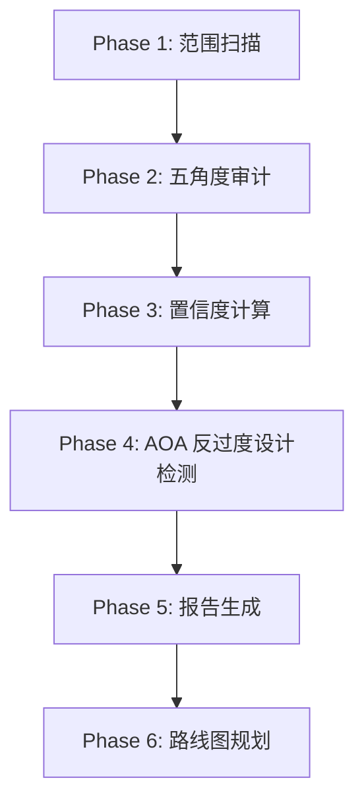
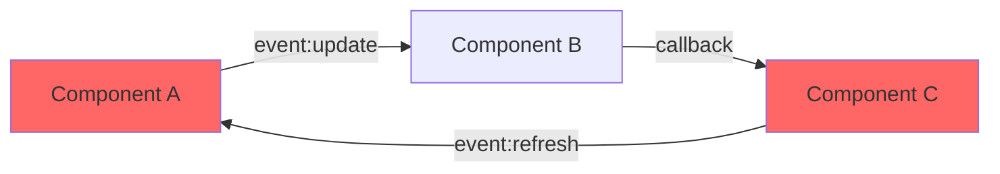
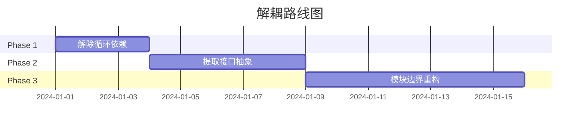

# 🔧 Decoupling Auditor (解耦审计师)

// turbo-all

## 环境要求

> [!NOTE]
> 本 Skill 为**纯指令型**，无需安装任何依赖。

---

## 触发方式

```
/decoupling-audit [scope] [--flags]

示例：
/decoupling-audit                          # 审计整个项目
/decoupling-audit src/components/          # 审计指定目录
/decoupling-audit --focus=coupling         # 聚焦耦合度分析
/decoupling-audit --skip-yagni             # 跳过 YAGNI 守护
```

---

## 参数说明

| 参数 | 类型 | 默认值 | 说明 |
|------|------|--------|------|
| `scope` | string | `.` | 审计范围（目录或文件） |
| `--focus` | enum | `all` | 聚焦角度: `coupling`, `srp`, `dependency`, `messaging`, `yagni` |
| `--skip-yagni` | flag | false | 跳过 YAGNI 过度设计检测 |
| `--min-confidence` | int | 60 | 最低置信度阈值，低于此值不报告 |
| `--depth` | enum | `normal` | 分析深度: `shallow`, `normal`, `deep` |

---

## 工作流程



### Phase 1: 范围扫描

1. 解析 `scope` 参数确定审计边界
2. 扫描所有源代码文件，构建文件依赖图
3. 识别项目类型（TypeScript/JavaScript/Python/Go 等）
4. 统计基础指标：文件数、LOC、模块数

**输出**：
```json
{
  "project_type": "typescript",
  "files_count": 127,
  "total_loc": 15420,
  "modules_detected": 12
}
```

---

### Phase 2: 五角度批判性审计 (CDA)

> [!IMPORTANT]
> 核心审计阶段，从五个维度系统性评估代码耦合问题。

#### 角度 1: 耦合度分析 (Coupling Analysis)

**检测目标**：
- 循环依赖 (Circular Dependencies)
- 上帝对象 (God Objects) - 依赖超过 10 个模块的类/文件
- 过度继承 (Deep Inheritance) - 继承深度 > 3
- 紧密依赖 (Tight Coupling) - 直接访问内部状态

**评估指标**：
| 指标 | 健康阈值 | 警告阈值 | 危险阈值 |
|------|---------|---------|---------|
| 循环依赖数 | 0 | 1-3 | >3 |
| 最大扇出 (Fan-out) | ≤7 | 8-12 | >12 |
| 继承深度 | ≤3 | 4-5 | >5 |

---

#### 角度 2: 职责边界分析 (SRP - Single Responsibility)

**检测目标**：
- 功能混杂 - 单文件包含多个不相关职责
- 跨层调用 - 表现层直接访问数据层
- 数据与逻辑耦合 - 数据模型包含业务逻辑

**评估方法**：
1. 分析函数/类名语义，检测职责混淆信号词
2. 检查 import 路径，识别跨层引用
3. 分析类/模块的公共方法数量（>10 为警告）

---

#### 角度 3: 依赖健康度分析 (Dependency Health)

**检测目标**：
- 硬编码依赖 - 直接 `new` 而非注入
- 缺少接口抽象 - 具体类作为参数类型
- 依赖方向违反 - 底层模块依赖上层

**评估原则**：
```
稳定依赖原则 (SDP): 依赖应指向更稳定的方向
抽象依赖原则 (DIP): 高层模块不应依赖底层模块实现
```

---

#### 角度 4: 消息流复杂度分析 (Message Flow)

**检测目标**：
- 回调地狱 - 嵌套回调深度 > 3
- 深层事件链 - 事件触发链 > 4 跳
- 隐式状态共享 - 通过全局变量传递状态
- Pub/Sub 混乱 - 同一事件被多处订阅且无文档

**可视化输出**：


---

#### 角度 5: YAGNI 守护 (Anti-Overengineering)

> [!CAUTION]
> 防止"过度设计"是本审计的核心差异化能力。

**过度设计信号检测**：

| 信号类型 | 检测特征 | 严重程度 |
|---------|---------|---------|
| **预留式抽象** | 接口仅有 1 个实现类 | 🟡 中 |
| **策略模式滥用** | 简单 if-else 被抽象为策略 | 🟡 中 |
| **过早泛化** | 泛型参数未在多处使用 | 🟢 低 |
| **层级膨胀** | 穿透式调用（A→B→C→D，B/C 仅转发） | 🔴 高 |
| **配置驱动一切** | 常量也变成配置项 | 🟢 低 |
| **工厂过载** | 工厂方法仅创建一种对象 | 🟡 中 |

**批判性问题**（对每个抽象层必须回答）：
1. ❓ 这个抽象解决了什么**当前存在的**问题？
2. ❓ 如果删除这一层，代码会变得更难维护吗？
3. ❓ 在可预见的 6 个月内，这个扩展点会被使用吗？

---

### Phase 3: 置信度计算

> [!IMPORTANT]
> 每个重构建议必须附带量化置信度，避免主观臆断。

**置信度公式**：
```
Confidence = 0.3 × (1 - BlastRadius/MaxBlast) 
           + 0.25 × TestCoverage 
           + 0.25 × (1 - ReverseDeps/MaxDeps)
           + 0.2 × (1 - ChangeComplexity)
```

**分量说明**：

| 分量 | 权重 | 计算方式 |
|------|------|---------|
| **影响范围** (Blast Radius) | 30% | 受影响文件数 / 项目总文件数 |
| **测试覆盖** | 25% | 受影响代码的测试覆盖率 |
| **逆向依赖** | 25% | 被依赖的模块数 / 最大依赖数 |
| **变更复杂度** | 20% | 基于 LOC 变更量和逻辑复杂度 |

**置信度级别**：

| 级别 | 分数 | 图标 | 决策建议 |
|------|------|------|---------|
| 高置信 | 85-100 | 🟢 | 可直接执行 |
| 中置信 | 60-84 | 🟡 | 需人工复核 |
| 低置信 | 0-59 | 🔴 | 建议进一步分析 |

---

### Phase 4: AOA 反过度设计检测

针对 Phase 2 角度 5 的发现，进行深入分析：

1. **删除测试**：假设删除该抽象，分析会破坏什么
2. **替代方案评估**：给出更简单的实现方式
3. **成本效益分析**：维护成本 vs 带来的灵活性

**输出格式**：
```markdown
### AOA Flag: 预留式抽象

**位置**: `src/services/IPaymentProcessor.ts`
**问题**: 接口 `IPaymentProcessor` 仅有 `StripeProcessor` 一个实现
**置信度**: 🟢 88/100

**删除测试结果**:
- 直接使用 `StripeProcessor` 不影响任何功能
- 无需修改任何调用点

**建议**: 
1. 删除 `IPaymentProcessor` 接口
2. 直接使用 `StripeProcessor` 类
3. 当真正需要第二个支付处理器时再引入接口

**预估节省**: 
- 删除 1 个文件
- 简化 3 处依赖注入配置
```

---

### Phase 5: 报告生成

**报告结构**：

```markdown
# 解耦审计报告

## 执行摘要

| 指标 | 值 |
|------|-----|
| 审计范围 | {scope} |
| 扫描文件数 | {files_count} |
| 发现问题数 | {issues_count} |
| 平均置信度 | {avg_confidence}% |
| 过度设计警告 | {aoa_flags_count} |

## 健康度评分

```
耦合度:     ████████░░ 80%
职责边界:   ██████░░░░ 60%
依赖健康度: █████████░ 90%
消息流:     ███████░░░ 70%
YAGNI 合规: ██████░░░░ 60%
────────────────────────
总体健康度: ███████░░░ 72%
```

## 问题清单

### 🔴 P0: 必须修复
{按置信度降序排列的问题列表}

### 🟡 P1: 建议修复
{...}

### 🟢 P2: 可选优化
{...}

## AOA 反过度设计警告
{过度设计分析结果}

## 解耦路线图
{推荐的重构顺序和依赖关系}

## 风险矩阵
{每个重构步骤的风险评估}
```

---

### Phase 6: 路线图规划

基于问题优先级和依赖关系，生成重构路线图：



**路线图原则**：
1. **先解耦后优化** - 先消除循环依赖，再考虑性能
2. **高置信优先** - 置信度高的修改先执行
3. **小步快跑** - 每个 PR 不超过 300 LOC 变更
4. **可回滚保证** - 每步都保证可安全回滚

---

## 输出示例

```markdown
# 解耦审计报告

## 执行摘要

| 指标 | 值 |
|------|-----|
| 审计范围 | `src/` |
| 扫描文件数 | 127 |
| 发现问题数 | 8 |
| 平均置信度 | 76% |
| 过度设计警告 | 3 |

---

## 🔴 P0: 必须修复

### 循环依赖: UserService ↔ AuthService

- **位置**: 
  - `src/services/UserService.ts:L45`
  - `src/services/AuthService.ts:L23`
- **问题类型**: 耦合度 - 循环依赖
- **描述**: UserService 导入 AuthService 验证用户，同时 AuthService 导入 UserService 获取用户信息。
- **证据**:
  ```typescript
  // UserService.ts
  import { AuthService } from './AuthService'; // L2
  
  // AuthService.ts  
  import { UserService } from './UserService'; // L3
  ```
- **重构建议**: 
  1. 提取共享的 `UserCredentials` 接口到独立文件
  2. 使用依赖注入由上层组装两个服务
- **置信度**: 🟢 92/100
  - 影响范围: 3 文件 (低)
  - 测试覆盖: 85% (高)
  - 逆向依赖: 2 模块 (低)
  - 变更复杂度: 低

---

## AOA 反过度设计警告

| 模块 | 过度设计信号 | 置信度 | 建议 |
|------|-------------|--------|------|
| `ILogger` | 预留式抽象 | 🟢 85 | 仅 ConsoleLogger 实现，建议删除接口 |
| `ConfigFactory` | 工厂过载 | 🟡 72 | 仅创建 JsonConfig，考虑直接实例化 |
| `EventBus` | 层级膨胀 | 🔴 56 | 需进一步分析事件流向后决定 |
```

---

## 错误处理

| 错误 | 原因 | 解决方案 |
|------|------|----------|
| `No source files found` | scope 路径无效 | 检查路径是否正确 |
| `Unsupported project type` | 无法识别项目类型 | 手动指定 `--type=ts` |
| `Confidence calculation failed` | 缺少测试覆盖率数据 | 运行 `--skip-coverage` 跳过覆盖率计算 |

---

## Immutability Declaration

| 守护字段 | 当前值 | 锁定版本 |
|----------|--------|----------|
| `五角度审计框架` | CDA v1.0 | v1.0.0 |
| `置信度公式` | 四分量加权 | v1.0.0 |
| `AOA 信号列表` | 6 类过度设计信号 | v1.0.0 |
