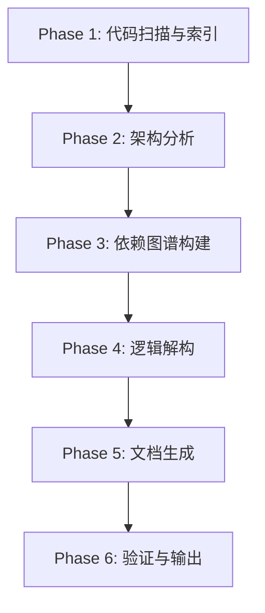
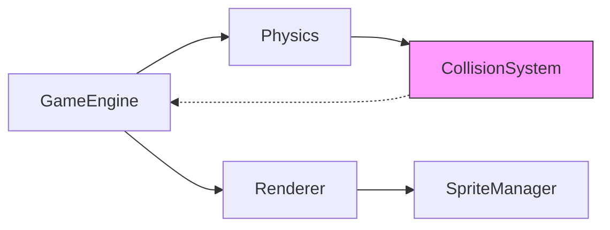
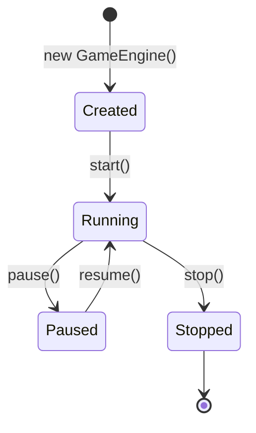

# Code Documentation Generator (代码文档生成器)

// turbo-all

> **核心理念**: 生成的文档不是"描述代码做了什么"，而是**"如何从零复刻这份代码"**。

## 环境要求

> [!NOTE]
> 本 Skill 为**纯指令型**，无需安装任何依赖。

---

## 触发方式

```
/doc-gen <目标路径> [--depth <层级>] [--format <格式>] [--scope <范围>]

示例：
/doc-gen ./src/components/Button.tsx
/doc-gen ./src --depth 2 --scope architecture
/doc-gen ./game-engine --format replicable
```

---

## 参数说明

| 参数 | 类型 | 默认值 | 说明 |
|------|------|--------|------|
| `目标路径` | string | 必填 | 源代码文件或目录路径 |
| `--depth` | number | `3` | 目录递归深度 (1=仅当前层, 2=含子目录...) |
| `--format` | enum | `replicable` | 输出格式: `replicable`(可复刻), `overview`(概览), `api`(API文档) |
| `--scope` | enum | `full` | 范围: `full`(完整), `architecture`(架构), `logic`(核心逻辑), `interface`(接口) |
| `--output` | string | `./docs/{filename}_doc.md` | 输出路径 |

---

## 工作流程



### Phase 1: 代码扫描与索引

> 目标: 建立代码全景视图

**步骤**:
1. 使用 `list_dir` 扫描目标目录结构
2. 使用 `view_file_outline` 获取每个文件的函数/类索引
3. 识别入口点文件 (main, index, app, etc.)
4. 建立文件间引用关系

**输出**: 
```markdown
## 📁 项目结构
├── src/
│   ├── components/     # React 组件 (12 files)
│   ├── hooks/          # 自定义 Hooks (5 files)
│   └── utils/          # 工具函数 (8 files)
└── ...
```

---

### Phase 2: 架构分析

> 目标: 识别设计模式与架构决策

**分析维度**:

| 维度 | 检测内容 | 文档输出 |
|------|----------|----------|
| **分层架构** | MVC/MVVM/Clean Architecture | 层级职责与边界 |
| **设计模式** | Factory/Singleton/Observer等 | 模式用途与实现位置 |
| **状态管理** | Redux/Zustand/Context | 状态流向与更新机制 |
| **依赖注入** | DI容器/手动注入 | 依赖图与生命周期 |
| **错误处理** | Try-Catch/Result/Either | 异常传播路径 |

**输出模板**:
```markdown
## 🏗️ 架构设计

### 整体架构
[架构图 - Mermaid]

### 核心设计决策
1. **为什么选择 X 而不是 Y**: [理由]
2. **关键权衡**: [描述]
```

---

### Phase 3: 依赖图谱构建

> 目标: 绘制模块间依赖关系

**分析方法**:
1. 扫描 `import`/`require`/`from` 语句
2. 识别内部依赖 vs 外部依赖
3. 检测循环依赖
4. 标注依赖方向 (单向/双向)

**输出示例**:


**依赖清单表**:
```markdown
| 模块 | 依赖项 | 被依赖于 | 循环依赖 |
|------|--------|----------|----------|
| GameEngine | Physics, Renderer | main.ts | ❌ |
| CollisionSystem | - | Physics | ⚠️ GameEngine |
```

---

### Phase 4: 逻辑解构 (核心阶段)

> 目标: **逐函数、逐类、逐行**解构实现逻辑

#### 4.1 函数级文档

对每个**关键函数**生成以下内容:

```markdown
### `functionName(params): ReturnType`

**📍 位置**: `src/utils/helpers.ts:45-78`

**🎯 职责**: [单句描述]

**📥 输入参数**:
| 参数 | 类型 | 约束 | 示例值 |
|------|------|------|--------|
| userId | string | UUID格式 | "550e8400-e29b-41d4-a716-446655440000" |

**📤 返回值**:
| 类型 | 条件 | 示例 |
|------|------|------|
| User | 成功 | `{ id: "...", name: "John" }` |
| null | 用户不存在 | `null` |

**🔄 执行流程**:
1. 验证输入参数格式
2. 查询数据库 `users` 表
3. 转换为 DTO 格式
4. 返回结果

**💡 关键实现细节**:
```typescript
// 第 52-56 行: 缓存优先策略
const cached = cache.get(userId);
if (cached) return cached;

// 第 60-65 行: 数据库查询
const user = await db.query('SELECT * FROM users WHERE id = ?', [userId]);
```

**⚠️ 边界条件**:
- 输入为空字符串 → 返回 null
- 数据库超时 → 抛出 TimeoutError

**🔗 调用关系**:
- 被调用于: `UserController.getProfile()`, `AuthService.validateToken()`
- 调用了: `cache.get()`, `db.query()`
```

#### 4.2 类级文档

```markdown
### Class: `GameEngine`

**📍 位置**: `src/engine/GameEngine.ts`

**🎯 职责**: 游戏主循环控制器，协调所有子系统

**📦 属性 (Properties)**:
| 属性 | 类型 | 可见性 | 默认值 | 作用 |
|------|------|--------|--------|------|
| `isRunning` | boolean | private | false | 游戏运行状态 |
| `fps` | number | public | 60 | 目标帧率 |
| `systems` | System[] | private | [] | 已注册的子系统 |

**🔧 方法概览**:
| 方法 | 签名 | 职责 |
|------|------|------|
| `start()` | `(): void` | 启动游戏循环 |
| `stop()` | `(): void` | 停止游戏循环 |
| `update(dt)` | `(dt: number): void` | 帧更新 |
| `registerSystem(s)` | `(s: System): void` | 注册子系统 |

**🏭 构造函数**:
```typescript
constructor(config: EngineConfig) {
  this.fps = config.fps ?? 60;
  this.systems = [];
  this.setupEventListeners();
}
```

**🔄 生命周期**:

```

#### 4.3 算法与复杂逻辑

对于**算法、状态机、复杂业务逻辑**，提供:

```markdown
### 算法: 碰撞检测 (AABB)

**📍 位置**: `src/physics/collision.ts:120-185`

**🧮 算法描述**:
AABB (Axis-Aligned Bounding Box) 碰撞检测

**📐 数学原理**:
两个矩形相交当且仅当:
- `rect1.left < rect2.right`
- `rect1.right > rect2.left`  
- `rect1.top < rect2.bottom`
- `rect1.bottom > rect2.top`

**🖼️ 图解**:
```
    ┌──────────┐
    │  Rect A  │      ┌──────────┐
    │          │──────│  Rect B  │
    └──────────┘      │          │
                      └──────────┘
         ↑
    Collision Zone
```

**⏱️ 复杂度**:
- 时间: O(n²) 朴素实现 / O(n log n) 使用空间分区
- 空间: O(1)

**🔄 逐步实现**:
```typescript
// Step 1: 获取边界框
const boundsA = entity1.getBounds();
const boundsB = entity2.getBounds();

// Step 2: X轴检测
const overlapX = boundsA.left < boundsB.right && boundsA.right > boundsB.left;

// Step 3: Y轴检测  
const overlapY = boundsA.top < boundsB.bottom && boundsA.bottom > boundsB.top;

// Step 4: 返回结果
return overlapX && overlapY;
```
```

---

### Phase 5: 文档生成

> 目标: 按模板组装完整文档

**文档结构**:

```markdown
# [项目名] 技术文档

> 🎯 本文档详细程度可支持从零复刻整个项目

## 目录
1. [项目概览](#项目概览)
2. [架构设计](#架构设计)
3. [依赖关系](#依赖关系)
4. [核心模块详解](#核心模块详解)
5. [数据流](#数据流)
6. [复刻指南](#复刻指南)

---

## 1. 项目概览
### 1.1 技术栈
### 1.2 目录结构
### 1.3 入口点

---

## 2. 架构设计
### 2.1 整体架构图
### 2.2 设计决策
### 2.3 模式使用

---

## 3. 依赖关系
### 3.1 外部依赖
### 3.2 内部模块依赖图
### 3.3 循环依赖警告

---

## 4. 核心模块详解
### 4.1 [模块A]
#### 4.1.1 职责
#### 4.1.2 类与函数
#### 4.1.3 关键算法

### 4.2 [模块B]
...

---

## 5. 数据流
### 5.1 用户操作流程
### 5.2 状态更新流程
### 5.3 事件传播路径

---

## 6. 复刻指南

> [!IMPORTANT]
> **按此顺序实现可最小化依赖阻塞**

### Step 1: 基础设施
1. 创建项目结构
2. 安装依赖: `npm install xxx`
3. 配置 TypeScript/ESLint

### Step 2: 核心类型定义
创建 `types/` 目录，定义以下接口:
```typescript
// types/index.ts
export interface Config { ... }
export interface Entity { ... }
```

### Step 3: 工具函数
按以下顺序实现 `utils/`:
1. `helpers.ts` - 无依赖工具
2. `validators.ts` - 依赖 helpers
...

### Step N: 最终集成
```typescript
// 入口文件整合
import { Engine } from './engine';
import { UI } from './ui';

const app = new Engine();
app.start();
```
```

---

### Phase 6: 验证与输出

**验证清单**:

| 检查项 | 标准 | ✅/❌ |
|--------|------|------|
| 所有公开函数已文档化 | 100% 覆盖 | |
| 所有类已文档化 | 100% 覆盖 | |
| 依赖图完整 | 无孤立节点 | |
| 代码示例可运行 | 语法正确 | |
| 复刻指南完整 | 包含所有步骤 | |

**输出**:
- 写入文件: `{output路径}`
- 通知用户文档位置

---

## 输出格式规范

### 可复刻文档 (format=replicable)

完整结构，包含:
- 所有函数逐行解析
- 完整代码示例
- 实现顺序指导

### 架构文档 (format=overview)

精简结构，仅包含:
- 架构图
- 模块职责
- 关键接口

### API文档 (format=api)

专注接口，包含:
- 函数签名
- 参数类型
- 返回值
- 示例调用

---

## Immutability Declaration

| 守护字段 | 当前值 | 锁定版本 |
|----------|--------|----------|
| doc_structure | 6大章节结构 | v1.0.0 |
| replicable_principle | "详细到可复刻" | v1.0.0 |
| phase_workflow | 6阶段流程 | v1.0.0 |

---

## 错误处理

| 错误 | 原因 | 解决方案 |
|------|------|----------|
| 目标路径不存在 | 路径错误 | 检查路径拼写 |
| 文件过大无法完整解析 | 单文件 >5000 行 | 使用 `--scope architecture` 仅分析架构 |
| 依赖图循环过深 | 架构问题 | 文档中标注警告，建议重构 |
| 二进制文件 | 非源代码 | 自动跳过，记录到忽略列表 |

---

## 输出示例

### 输入
```
/doc-gen ./src/game/Player.ts --format replicable
```

### 输出摘要
```markdown
# Player.ts 技术文档

## 概览
- 文件位置: `src/game/Player.ts`
- 代码行数: 245
- 类数量: 1
- 函数数量: 12
- 复杂度: 中等

## 类: Player

### 构造函数
...

### 方法详解
...

## 复刻指南
1. 先实现 `Entity` 基类
2. 实现 `Player` 继承
3. 添加输入处理
...
```

---

## 高级用法

### 批量生成
```
/doc-gen ./src --depth 2 --scope full
```
生成整个 `src/` 目录的文档

### 增量更新
```
/doc-gen ./src/new-feature --append-to ./docs/main.md
```
追加到现有文档

### 对比模式
```
/doc-gen ./v1 ./v2 --diff
```
生成两个版本的差异文档
