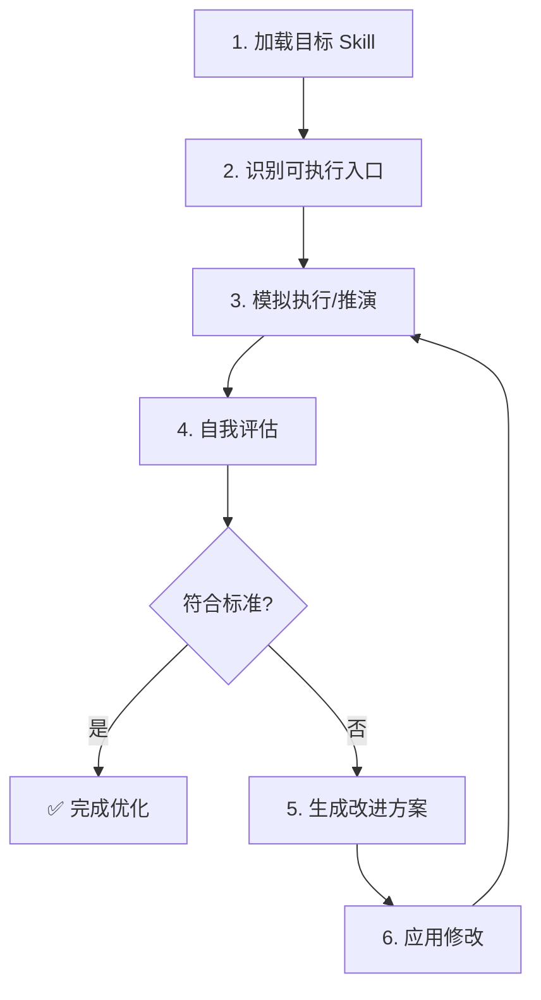

# RLAIF Optimizer (Ralph Loop)

// turbo-all

本 Skill 实现了一个 **Ralph Loop**（基于 AI 反馈的强化学习）循环，专为迭代优化 Claude Skills 设计。

> **核心理念**：Claude 自身就是评估者和改进者，无需外部 LLM API。

---

## 触发方式

```
/rlaif <目标技能路径>

示例：
/rlaif .claude/skills/wechat-article-generator
优化skill xiaohongshu-copywriter
```

**参数说明**：

| 参数 | 说明 | 示例 |
|------|------|------|
| 目标技能 | 要优化的 Skill 目录名或路径 | `wechat-article-generator` |
| 测试 Prompt（可选） | 用于测试技能的输入 | `"写一篇关于AI的文章"` |
| 成功标准（可选） | 判断成功的自然语言描述 | `"文章结构清晰，无敏感词"` |

---

## 优化循环流程



---

## Phase 0: 版本备份 (Version Backup)

> [!IMPORTANT]
> 在修改任何 Skill 之前，**必须**先备份当前版本！

### 0.1 检查当前版本

1. 读取 `{目标}/CHANGELOG.md` 获取当前版本号
2. 如无版本号，默认为 `v1.0.0`

### 0.2 创建版本归档

```bash
# 目录结构
{目标}/
├── SKILL.md              # 当前活跃版本
├── CHANGELOG.md          # 版本变更日志
├── EVALUATION_LOG.md     # 评估历史记录
└── versions/
    ├── v1.0.0/
    │   └── SKILL.md      # 原始版本存档
    └── v2.0.0/
        └── SKILL.md      # 优化后版本存档
```

### 0.3 执行备份

```
复制 {目标}/SKILL.md 到 {目标}/versions/vX.Y.Z/SKILL.md
```

---

## Phase 1: 加载与分析

执行以下步骤：

1. **读取目标 SKILL.md**
   ```
   读取 .claude/skills/{目标}/SKILL.md
   ```

2. **结构分析**：检查以下要素
   - [ ] 是否有 YAML frontmatter（trigger, description）
   - [ ] 是否有清晰的触发方式说明
   - [ ] 是否有工作流程/Phase 定义
   - [ ] scripts/ 目录下是否有可执行脚本
   - [ ] 是否有依赖声明（如 pyproject.toml）

3. **输出分析报告**：
   ```markdown
   ## 目标 Skill 分析报告
   
   | 检查项 | 状态 | 备注 |
   |--------|------|------|
   | Frontmatter | ✅/❌ | ... |
   | 触发方式 | ✅/❌ | ... |
   | 工作流程 | ✅/❌ | ... |
   | 脚本执行层 | ✅/❌ | ... |
   | 依赖管理 | ✅/❌ | ... |
   ```

---

## Phase 2: 模拟执行

根据 Skill 类型选择评估方式：

### 2.1 纯指令型 Skill（无脚本）
- Claude 自行模拟执行该 Skill 的指令
- 生成示例输出
- 检查指令是否清晰、无歧义

### 2.2 脚本型 Skill（有 scripts/）
- 执行脚本（如 `uv run python scripts/xxx.py --help`）
- 捕获 stdout/stderr
- 检查是否有运行时错误

---

## Phase 3: 自我评估 (Critique)

作为 **QA 专家**，对 Skill 进行严格评估：

### 评估维度

| 维度 | 权重 | 评分标准 |
|------|------|----------|
| 可用性 | 25% | 用户能否轻松触发和使用 |
| 清晰度 | 20% | 指令是否明确无歧义 |
| 完整性 | 20% | 工作流是否覆盖完整用例 |
| 健壮性 | 15% | 是否处理错误和边界情况 |
| 风格一致性 | 10% | 是否符合 Skill 规范格式 |
| **置信度** | 10% | 评估者对本次评估的确信程度 |

### 置信度说明

> [!IMPORTANT]
> 置信度是评估质量的元指标，确保 Skill 可用性判断可靠。

| 置信度级别 | 分数 | 含义 |
|------------|------|------|
| 🟢 高置信 | 80-100 | 已实际执行验证，结果可复现 |
| 🟡 中置信 | 50-79 | 仅模拟推演，未实际运行脚本 |
| 🔴 低置信 | 0-49 | 无法验证，存在不确定因素 |

**影响评估结论的因素**：
- ✅ 已执行 `uv run` 并成功 → 高置信
- ⚠️ 仅阅读代码推演 → 中置信
- ❌ 依赖未安装/环境异常 → 低置信
- ❌ 脚本有外部依赖(API/数据库) → 降低置信

### 输出评估结果

```markdown
## 评估结果

**总分**: X/100
**置信度**: 🟢/🟡/🔴 (X/100) - [原因说明]

### 问题清单
1. [严重] 描述问题1
2. [中等] 描述问题2
3. [轻微] 描述问题3

### 改进建议
- 建议1：具体修改方案
- 建议2：具体修改方案
```

---

## Phase 4: 生成补丁 (Patch)

如果评估不通过（总分 < 80 或存在严重问题）：

1. **生成差异**：明确列出需要修改的文件和内容
2. **应用修改**：使用文件编辑工具修改目标 Skill
3. **更新版本号**：递增 minor 或 major 版本
4. **记录日志**：将修改历史追加到 `{目标}/CHANGELOG.md`

### 补丁格式

```markdown
## Patch Log - {日期}

### 修改文件
- `SKILL.md`: 添加缺失的 frontmatter
- `scripts/main.py`: 修复类型提示

### 修改详情
[具体 diff 或描述]
```

---

## Phase 5: 迭代验证

1. 重新执行 Phase 2-3
2. 如果通过，输出最终报告
3. 如果仍不通过，最多迭代 **3 次**
4. 超过最大迭代次数，输出：
   ```
   ⚠️ 已达最大迭代次数，仍存在以下问题：
   [问题列表]
   
   建议人工介入审查。
   ```

---

## Phase 6: 记录评估日志 (Evaluation Log)

**必须**将本次评估记录到 `{目标}/EVALUATION_LOG.md`：

### 日志格式

```markdown
### Eval #XXX - {日期}

| 字段 | 值 |
|------|-----|
| **版本** | vX.Y.Z → vX.Y.Z |
| **场景** | 测试场景描述 |
| **测试 Prompt** | 用户原始输入 |
| **评估分数** | XX/100 → XX/100 |
| **评估者** | Claude (RLAIF) |

#### 问题发现
| 严重程度 | 问题 | 影响 |
|----------|------|------|
| 🔴/🟡/🟢 | 问题描述 | 影响说明 |

#### 改进内容
- ✅ 改进项1
- ✅ 改进项2

#### 验证结果
\`\`\`
✅/❌ 验证步骤1
✅/❌ 验证步骤2
\`\`\`
```

---

## 输出产物

| 文件 | 说明 |
|------|------|
| `{目标}/versions/vX.Y.Z/SKILL.md` | 旧版本归档 |
| `{目标}/SKILL.md` | 优化后的新版本 |
| `{目标}/CHANGELOG.md` | 追加版本变更日志 |
| `{目标}/EVALUATION_LOG.md` | 追加评估详情（场景/分数/版本） |
| 控制台输出 | 评估报告 + 改进过程 |

---

## 使用示例

### 示例 1：优化微信文章生成器

```
/rlaif wechat-article-generator
```

Claude 将会：
1. 读取 `wechat-article-generator/SKILL.md`
2. 检查触发词、流程完整性
3. 模拟执行生成一篇测试文章
4. 评估输出质量
5. 如有问题，自动修复并验证

### 示例 2：带自定义标准

```
优化skill xiaohongshu-copywriter，确保输出包含emoji和标签
```

---

## 注意事项

- 🔒 **安全**：不会自动执行可能有副作用的脚本（如网络请求、文件删除）
- 📝 **透明**：所有修改都会记录在 CHANGELOG.md
- 🔄 **可逆**：建议在优化前 git commit，便于回滚
