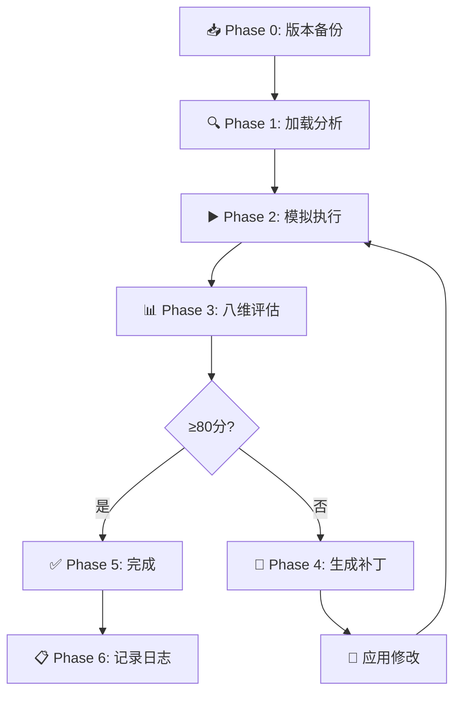

# RLAIF Optimizer (Ralph Loop) v2.1

// turbo-all

本 Skill 实现了一个 **Ralph Loop**（基于 AI 反馈的强化学习）循环，专为迭代优化 Claude Skills 设计。

> **核心理念**：Claude 自身就是评估者和改进者，无需外部 LLM API。

---

## 环境依赖

| 依赖 | 用途 | 检查命令 |
|------|------|----------|
| `uv` | Python 环境管理 | `uv --version` |
| `git` | 版本控制(可选) | `git --version` |

> [!TIP]
> 对于脚本型 Skills，执行前会自动检查 `uv` 是否可用。

---

## 触发方式

```
/rlaif <目标技能路径>

示例：
/rlaif .claude/skills/wechat-article-generator
优化skill xiaohongshu-copywriter
/rlaif --all .claude/skills/         # 批量评估
/rlaif --batch skill1,skill2,skill3  # 指定多个
```

**参数说明**：

| 参数 | 说明 | 示例 |
|------|------|------|
| 目标技能 | 要优化的 Skill 目录名或路径 | `wechat-article-generator` |
| `--all` | 批量评估指定目录下所有 Skills | `--all .claude/skills/` |
| `--batch` | 逗号分隔的多个 Skill | `--batch skill1,skill2` |
| 测试 Prompt（可选） | 用于测试技能的输入 | `"写一篇关于AI的文章"` |
| 成功标准（可选） | 判断成功的自然语言描述 | `"文章结构清晰，无敏感词"` |

---

## 优化循环流程



---

## Phase 0: 版本备份 (Version Backup)

> [!IMPORTANT]
> 在修改任何 Skill 之前，**必须**先备份当前版本！

### 0.1 检查当前版本

1. 读取 `{目标}/CHANGELOG.md` 获取当前版本号
2. 如无版本号，默认为 `v1.0.0`

### 0.2 创建版本归档

```
{目标}/
├── SKILL.md              # 当前活跃版本
├── CHANGELOG.md          # 版本变更日志
├── EVALUATION_LOG.md     # 评估历史记录
└── versions/
    ├── v1.0.0/
    │   └── SKILL.md      # 原始版本存档
    └── v2.0.0/
        └── SKILL.md      # 优化后版本存档
```

### 0.3 执行备份

```bash
# 创建版本目录并备份
mkdir -p {目标}/versions/vX.Y.Z/
cp {目标}/SKILL.md {目标}/versions/vX.Y.Z/SKILL.md
```

**输出**: `📦 已备份 v{X.Y.Z} 到 versions/ 目录`

---

## Phase 1: 加载与分析

执行以下步骤：

1. **读取目标 SKILL.md**
   ```
   读取 .claude/skills/{目标}/SKILL.md
   ```

2. **结构分析**：检查以下要素
   - [ ] 是否有 YAML frontmatter（trigger, description）
   - [ ] 是否有清晰的触发方式说明
   - [ ] 是否有工作流程/Phase 定义
   - [ ] scripts/ 目录下是否有可执行脚本
   - [ ] 是否有依赖声明（如 pyproject.toml）

3. **输出分析报告**：
   ```markdown
   🔍 目标 Skill 分析报告
   
   | 检查项 | 状态 | 备注 |
   |--------|------|------|
   | Frontmatter | ✅/❌ | ... |
   | 触发方式 | ✅/❌ | ... |
   | 工作流程 | ✅/❌ | ... |
   | 脚本执行层 | ✅/❌ | ... |
   | 依赖管理 | ✅/❌ | ... |
   ```

**输出**: `🔍 分析完成，发现 X 个检查项通过`

---

## Phase 2: 模拟执行

根据 Skill 类型选择评估方式：

### 2.1 纯指令型 Skill（无脚本）
- Claude 自行模拟执行该 Skill 的指令
- 生成示例输出
- 检查指令是否清晰、无歧义

### 2.2 脚本型 Skill（有 scripts/）

```bash
# 检查环境
uv --version || echo "❌ uv 未安装"

# 执行帮助命令
uv run python scripts/xxx.py --help
```

- 捕获 stdout/stderr
- 检查是否有运行时错误

**输出**: `▶️ 模拟执行完成，置信度 XX%`

---

## Phase 3: 八维评估 (Octagonal Audit)

作为 **QA 专家**，使用标准八维模型进行严格评估：

### 评估维度

```
                    结构完整性 (15%)
                          ▲
                         ╱ ╲
        用户体验 ◀━━━━━━╱   ╲━━━━━━▶ 指令清晰度
          (15%)       ╱     ╲        (15%)
                     ╱       ╲
                    ╱    ⭐   ╲
         可扩展性 ◀━━╱           ╲━━▶ 执行可靠性
          (10%)  ╲             ╱     (15%)
                  ╲           ╱
       可维护性 ◀━╲         ╱━▶ 上下文效率
          (10%)    ╲       ╱      (10%)
                    ╲     ╱
                     ╲   ╱
                      ▼ ▼
                安全与合规 (10%)
```

| 维度 | 权重 | 评分要点 |
|------|------|----------|
| **1. 结构完整性** | 15% | Frontmatter、Phase 定义、参数表、目录布局 |
| **2. 指令清晰度** | 15% | 无歧义语言、可操作步骤、完整示例、边界条件 |
| **3. 执行可靠性** | 15% | 脚本功能、错误处理、依赖声明、幂等性 |
| **4. 上下文效率** | 10% | Token 利用率、渐进式披露、避免冗余 |
| **5. 安全与合规** | 10% | 无破坏性命令、.env 管理、权限边界 |
| **6. 可维护性** | 10% | 版本控制(CHANGELOG)、日志(EVALUATION_LOG)、注释 |
| **7. 可扩展性** | 10% | 模块化设计、参数化配置、解耦逻辑 |
| **8. 用户体验** | 15% | 触发便捷、美观输出(emoji/表格)、进度指示 |

### 评分等级

| 分数 | 等级 | 徽章 | 解释 |
|------|------|------|------|
| 90-100 | S | 🏆 | 标杆技能；可作为模板 |
| 80-89 | A | 🥇 | 优秀；生产就绪 |
| 70-79 | B | 🥈 | 良好；需小幅改进 |
| 60-69 | C | 🥉 | 可用；建议优化 |
| 50-59 | D | ⚠️ | 边缘；需大幅改进 |
| <50 | F | ❌ | 不可用；需重新设计 |

### 置信度说明

| 置信度级别 | 分数 | 含义 |
|------------|------|------|
| 🟢 高置信 | 80-100 | 已实际执行验证，结果可复现 |
| 🟡 中置信 | 50-79 | 仅模拟推演，未实际运行脚本 |
| 🔴 低置信 | 0-49 | 无法验证，存在不确定因素 |

### 输出评估结果

```markdown
📊 八维评估结果

**总分**: X/100 → 等级: X (徽章)
**置信度**: 🟢/🟡/🔴 (X/100) - [原因说明]

### 各维度得分
| 维度 | 权重 | 得分 | 扣分原因 |
|------|------|------|----------|
| 结构完整性 | 15% | X/15 | ... |
| ... | ... | ... | ... |

### 问题清单
1. [🔴 P0] 描述问题1
2. [🟡 P1] 描述问题2
3. [🟢 P2] 描述问题3

### 改进建议
- 建议1：具体修改方案
- 建议2：具体修改方案
```

**输出**: `📊 评估完成：X/100 (等级 X)`

---

## Phase 4: 生成补丁 (Patch)

如果评估不通过（总分 < 80 或存在 P0 问题）：

1. **生成差异**：明确列出需要修改的文件和内容
2. **应用修改**：使用文件编辑工具修改目标 Skill
3. **更新版本号**：递增 minor 或 major 版本
4. **记录日志**：将修改历史追加到 `{目标}/CHANGELOG.md`

### 补丁格式

```markdown
🔧 Patch Log - {日期}

### 修改文件
- `SKILL.md`: 添加缺失的 frontmatter
- `scripts/main.py`: 修复类型提示

### 修改详情
[具体 diff 或描述]
```

**输出**: `🔧 已应用 X 个补丁`

---

## Phase 5: 迭代验证

1. 重新执行 Phase 2-3
2. 如果通过，输出最终报告
3. 如果仍不通过，最多迭代 **3 次**
4. 超过最大迭代次数，输出：
   ```
   ⚠️ 已达最大迭代次数 (3/3)，仍存在以下问题：
   [问题列表]
   
   建议人工介入审查。
   ```

**输出**: `✅ 迭代 X/3 完成` 或 `⚠️ 需人工介入`

---

## Phase 6: 记录评估日志 (Evaluation Log)

**必须**将本次评估记录到 `{目标}/EVALUATION_LOG.md`：

### 日志格式

```markdown
### Eval #XXX - {日期}

| 字段 | 值 |
|------|-----|
| **版本** | vX.Y.Z → vX.Y.Z |
| **场景** | 测试场景描述 |
| **测试 Prompt** | 用户原始输入 |
| **评估分数** | XX/100 → XX/100 |
| **评估者** | Claude (RLAIF) |
| **置信度** | 🟢/🟡/🔴 (X/100) - [原因] |

#### 问题发现
| 严重程度 | 问题 | 影响 |
|----------|------|------|
| 🔴/🟡/🟢 | 问题描述 | 影响说明 |

#### 改进内容
- ✅ 改进项1
- ✅ 改进项2

#### 验证结果
✅/❌ 验证步骤1
✅/❌ 验证步骤2
```

**输出**: `📋 评估日志已更新`

---

## 输出产物

| 文件 | 说明 |
|------|------|
| `{目标}/versions/vX.Y.Z/SKILL.md` | 旧版本归档 |
| `{目标}/SKILL.md` | 优化后的新版本 |
| `{目标}/CHANGELOG.md` | 追加版本变更日志 |
| `{目标}/EVALUATION_LOG.md` | 追加评估详情 |
| 控制台输出 | 评估报告 + 改进过程 |

---

## 使用示例

### 示例 1：优化单个 Skill

```
/rlaif wechat-article-generator
```

预期输出：
```
📦 已备份 v1.2.0 到 versions/ 目录
🔍 分析完成，发现 5/5 个检查项通过
▶️ 模拟执行完成，置信度 75%
📊 评估完成：82/100 (等级 A 🥇)
📋 评估日志已更新
```

### 示例 2：批量评估

```
/rlaif --all .claude/skills/
```

预期输出：
```
🔄 发现 8 个 Skills，开始批量评估...

[1/8] wechat-article-generator: 82/100 🥇
[2/8] xiaohongshu-copywriter: 75/100 🥈
...
[8/8] skill-rlaif: 90/100 🏆

📊 批量评估完成
- 平均分: 79/100
- 最高分: skill-rlaif (90)
- 需改进: 3 个 Skills
```

### 示例 3：带自定义标准

```
优化skill xiaohongshu-copywriter，确保输出包含emoji和标签
```

---

## 注意事项

- 🔒 **安全**：不会自动执行可能有副作用的脚本（如网络请求、文件删除）
- 📝 **透明**：所有修改都会记录在 CHANGELOG.md
- 🔄 **可逆**：建议在优化前 git commit，便于回滚
- ⚡ **高效**：批量模式串行执行，避免资源竞争
