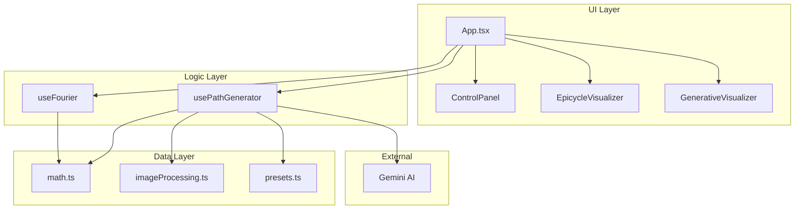
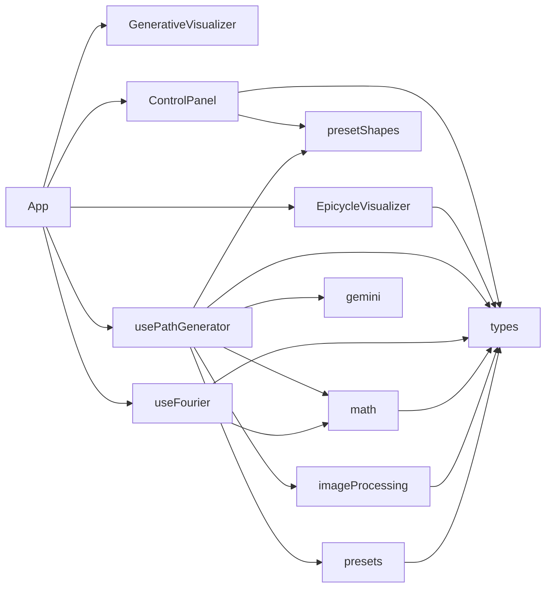
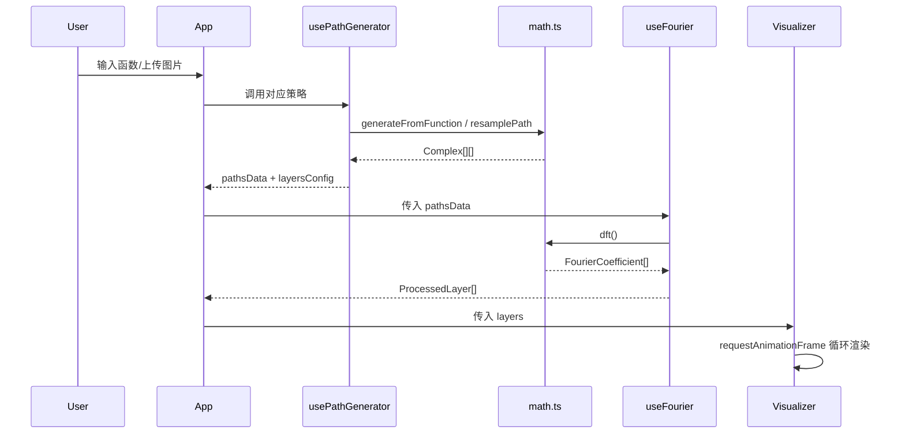
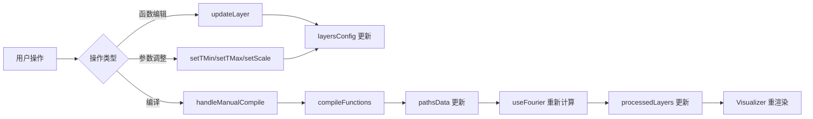

# DrawEverything (Fourier Architect) 技术文档

> 🎯 本文档详细程度可支持从零复刻整个项目

---

## 目录

1. [项目概览](#1-项目概览)
2. [架构设计](#2-架构设计)
3. [依赖关系](#3-依赖关系)
4. [核心模块详解](#4-核心模块详解)
5. [数据流](#5-数据流)
6. [复刻指南](#6-复刻指南)

---

## 1. 项目概览

### 1.1 项目简介

**DrawEverything** (内部名: `fourier-architect`) 是一个基于 **傅里叶级数** 的可视化应用。它能够:

- ✨ 将任意闭合曲线分解为傅里叶级数
- 🎨 使用旋转矢量 (Epicycles) 动画重建原始图形
- 🖼️ 从图片轮廓提取路径并转换为傅里叶表示
- 🤖 通过 AI (Gemini) 生成图像轮廓
- 📐 支持自定义数学函数绘图 (直角坐标/极坐标)

### 1.2 技术栈

| 类别 | 技术 | 版本 |
|------|------|------|
| **前端框架** | React | 19.2.3 |
| **构建工具** | Vite | 6.2.0 |
| **语言** | TypeScript | 5.8.2 |
| **AI 服务** | Google GenAI | 1.33.0 |
| **图标库** | Lucide React | 0.561.0 |

### 1.3 目录结构

```
draweverything/
├── 📄 index.html          # HTML 入口
├── 📄 index.tsx           # React 入口
├── 📄 App.tsx             # 主应用组件 (295行)
├── 📄 types.ts            # 类型定义 (61行)
├── 📁 components/
│   ├── ControlPanel.tsx       # 控制面板 (286行)
│   ├── EpicycleVisualizer.tsx # 傅里叶可视化器 (477行)
│   └── GenerativeVisualizer.tsx # 粒子系统可视化器 (183行)
├── 📁 hooks/
│   ├── useFourier.ts          # 傅里叶变换Hook (49行)
│   └── usePathGenerator.ts    # 路径生成Hook (207行)
├── 📁 utils/
│   ├── math.ts                # 数学工具 (182行)
│   ├── imageProcessing.ts     # 图像处理 (190行)
│   └── presetShapes.ts        # 预设形状 (43行)
├── 📁 services/
│   └── gemini.ts              # AI 服务 (59行)
├── 📁 constants/
│   └── presets.ts             # 预设配置 (291行)
└── 📄 vite.config.ts      # Vite 配置
```

### 1.4 入口点分析

**`index.tsx`** → 渲染根组件

```typescript
import React from 'react';
import ReactDOM from 'react-dom/client';
import App from './App';

ReactDOM.createRoot(document.getElementById('root')!).render(
  <React.StrictMode><App /></React.StrictMode>
);
```

---

## 2. 架构设计

### 2.1 整体架构图



### 2.2 核心设计决策

| 决策 | 选择 | 理由 |
|------|------|------|
| **状态管理** | React Hooks | 项目规模适中，无需 Redux/Zustand |
| **渲染引擎** | Canvas 2D | 高性能实时绘图，支持数千帧动画 |
| **数学计算** | 纯 JavaScript | 避免 Web Worker 复杂性，利用 `useMemo` 优化 |
| **AI 集成** | Google GenAI SDK | 直接调用，生成轮廓用剪影图像 |

### 2.3 设计模式

1. **Custom Hooks 模式** - `useFourier`, `usePathGenerator` 封装业务逻辑
2. **Strategy 模式** - 5 种路径生成策略 (数学函数、预设、图片、AI、静态样本)
3. **Separation of Concerns** - UI (组件) / Logic (Hooks) / Data (Utils) 分层

---

## 3. 依赖关系

### 3.1 外部依赖

| 包名 | 用途 |
|------|------|
| `react` / `react-dom` | UI 框架 |
| `@google/genai` | AI 图像生成 |
| `lucide-react` | 图标组件库 |
| `vite` | 开发/构建工具 |
| `typescript` | 类型系统 |

### 3.2 内部模块依赖图



### 3.3 依赖清单

| 模块 | 依赖项 | 被依赖于 |
|------|--------|----------|
| `types.ts` | 无 | 所有模块 |
| `math.ts` | types | useFourier, usePathGenerator |
| `imageProcessing.ts` | types | usePathGenerator |
| `gemini.ts` | @google/genai | usePathGenerator |
| `presets.ts` | types | usePathGenerator |
| `presetShapes.ts` | 无 | ControlPanel, usePathGenerator |
| `useFourier.ts` | types, math | App |
| `usePathGenerator.ts` | types, math, imageProcessing, gemini, presets, presetShapes | App |
| `ControlPanel.tsx` | types, presetShapes | App |
| `EpicycleVisualizer.tsx` | types | App |
| `GenerativeVisualizer.tsx` | 无 | App |
| `App.tsx` | 所有组件/Hooks | index.tsx |

---

## 4. 核心模块详解

### 4.1 类型定义 (`types.ts`)

**📍 位置**: `types.ts:1-61`

#### 核心接口

```typescript
// 复数表示 (傅里叶计算基础)
interface Complex {
  re: number;  // 实部
  im: number;  // 虚部
}

// 傅里叶系数 (DFT 输出)
interface FourierCoefficient {
  re: number;      // 实部
  im: number;      // 虚部
  freq: number;    // 频率
  amp: number;     // 振幅 (sqrt(re² + im²))
  phase: number;   // 相位 (atan2(im, re))
}

// 用户配置层 (输入)
interface MathLayer {
  xFn: string;         // x(t) 或 r(t) 函数字符串
  yFn: string;         // y(t) 或 θ(t) 函数字符串
  isPolar?: boolean;   // 是否极坐标
  colorHex: string;    // 线条颜色
  scaleMod?: number;   // 缩放因子
  opacity?: number;    // 透明度
  lineWidth?: number;  // 线宽
  fillColor?: string;  // 填充色
  ampModFn?: string;   // 振幅调制函数
}

// 处理后的层 (渲染器输入)
interface ProcessedLayer {
  id: string;
  coefficients: FourierCoefficient[];
  color: string;
  opacity: number;
  lineWidth: number;
  modFn: (t: number) => number;  // 编译后的调制函数
}

// 应用模式
enum AppMode {
  FUNCTION = 'FUNCTION',
  IMAGE_UPLOAD = 'IMAGE_UPLOAD',
  AI_GENERATE = 'AI_GENERATE'
}
```

---

### 4.2 数学工具 (`utils/math.ts`)

**📍 位置**: `utils/math.ts:1-182`

#### `dft(x: Complex[]): FourierCoefficient[]`

**🎯 职责**: 计算离散傅里叶变换

**📐 数学原理**:

$$X_k = \sum_{n=0}^{N-1} x_n \cdot e^{-i2\pi kn/N}$$

**🔄 执行流程**:
1. 遍历所有频率 k (0 到 N-1)
2. 对每个频率计算复数和
3. 归一化 (除以 N)
4. 计算振幅和相位
5. 按振幅降序排序

**💡 关键实现**:

```typescript
for (let k = 0; k < N; k++) {
  let re = 0, im = 0;
  const angleConst = (2 * Math.PI * k) / N;
  
  for (let n = 0; n < N; n++) {
    const phi = angleConst * n;
    re += x[n].re * Math.cos(phi) + x[n].im * Math.sin(phi);
    im += x[n].im * Math.cos(phi) - x[n].re * Math.sin(phi);
  }
  
  re /= N; im /= N;
  // ... 计算 amp, phase, freq
}
return X.sort((a, b) => b.amp - a.amp);  // 按振幅排序
```

**⏱️ 复杂度**: O(N²)

---

#### `resamplePath(points: Point[], targetCount: number): Complex[]`

**🎯 职责**: 将不均匀采样的路径重采样为均匀分布

**🔄 执行流程**:
1. 计算路径总长度
2. 构建累积距离数组
3. 按等距步长插值采样
4. 返回 Complex 数组

---

#### `generateFromFunction(...): Complex[]`

**🎯 职责**: 从数学函数字符串生成路径

**📥 输入参数**:
| 参数 | 类型 | 说明 |
|------|------|------|
| `fn1Str` | string | x(t) 或 r(t) |
| `fn2Str` | string | y(t) 或 θ(t) |
| `tMin/tMax` | number | 参数范围 |
| `points` | number | 采样点数 |
| `scale` | number | 缩放因子 |
| `isPolar` | boolean | 极坐标模式 |

**💡 关键实现**:

```typescript
const fn1 = new Function('t', `return ${fn1Str};`);
const fn2 = new Function('t', `return ${fn2Str};`);

for (let i = 0; i < points; i++) {
  const t = tMin + (tMax - tMin) * (i / points);
  let x, y;
  
  if (isPolar) {
    x = val1 * Math.cos(val2);
    y = val1 * Math.sin(val2);
  } else {
    x = val1;
    y = val2;
  }
  
  path.push({ re: x * scale, im: -y * scale }); // Y 轴翻转
}
```

---

### 4.3 图像处理 (`utils/imageProcessing.ts`)

**📍 位置**: `utils/imageProcessing.ts:1-190`

#### `extractContourFromImage(imageSrc: string, threshold?: number): Promise<Point[]>`

**🎯 职责**: 从图像提取轮廓路径

**🧮 算法**: Moore-Neighbor Tracing (摩尔邻域追踪)

**🔄 执行流程**:
1. 加载图像到 Canvas
2. 缩放到 512×512 (性能优化)
3. 转换为二值图像 (亮度阈值)
4. 找到起始点 (第一个黑色像素)
5. 顺时针遍历邻域找边界
6. 返回中心化的轮廓点

**📐 8-邻域方向**:

```
NW(7) N(0) NE(1)
 W(6)  ·   E(2)
SW(5) S(4) SE(3)
```

**⚠️ 边界条件**:
- 无对象 → 返回空数组
- 孤立像素 → 提前终止
- 最大迭代 = width × height × 2

---

### 4.4 Gemini AI 服务 (`services/gemini.ts`)

**📍 位置**: `services/gemini.ts:1-59`

#### `generateCharacterImage(prompt: string): Promise<string>`

**🎯 职责**: 调用 Gemini 生成剪影图像

**🔄 执行流程**:
1. 检查 API Key
2. 构建增强提示词 (强调黑白剪影)
3. 调用 `gemini-2.5-flash-image` 模型
4. 提取 Base64 图像数据
5. 返回 Data URL

**💡 提示词工程**:

```typescript
const enhancedPrompt = `
  Create a high-contrast solid black silhouette of ${prompt} 
  on a pure white background.
  Style: Vector art, flat, minimal, no internal details.
`;
```

---

### 4.5 Hook: usePathGenerator

**📍 位置**: `hooks/usePathGenerator.ts:1-207`

**🎯 职责**: 统一管理 5 种路径生成策略

#### 策略模式

| 策略 | 方法 | 输入源 |
|------|------|--------|
| 数学函数 | `compileFunctions()` | 用户输入的函数字符串 |
| 预设 | `loadPreset()` | `PRESETS` 常量 |
| 图片上传 | `processImage()` | File 对象 |
| AI 生成 | `processAI()` | 文本提示词 |
| 静态样本 | `processSample()` | SVG 预设 |

#### 返回值

```typescript
interface UsePathGeneratorResult {
  pathsData: Complex[][];        // 路径数据
  layersConfig: MathLayer[];     // 层配置
  loading: boolean;              // 加载状态
  error: string | null;          // 错误信息
  
  // Actions
  compileFunctions: (...) => void;
  loadPreset: (key: string) => PresetDef | null;
  processImage: (file: File, pointCount: number) => Promise<void>;
  processAI: (prompt: string, pointCount: number) => Promise<void>;
  processSample: (key: keyof PRESET_URIS, pointCount: number) => Promise<void>;
}
```

---

### 4.6 Hook: useFourier

**📍 位置**: `hooks/useFourier.ts:1-49`

**🎯 职责**: 将路径数据转换为可渲染的傅里叶层

**🔄 执行流程**:
1. **Heavy Computation** (useMemo): 仅当路径变化时计算 DFT
2. **Light Computation** (useMemo): 合并样式配置

```typescript
const dftResults = useMemo(() => {
  return pathsData.map(path => dft(path));
}, [pathsData]);  // 依赖路径数据

const processedLayers = useMemo(() => {
  return dftResults.map((coeffs, index) => ({
    id: `layer-${index}`,
    coefficients: coeffs,
    color: config.colorHex,
    // ...
  }));
}, [dftResults, layerConfigs]);  // 依赖 DFT 结果 + 样式
```

---

### 4.7 组件: EpicycleVisualizer

**📍 位置**: `components/EpicycleVisualizer.tsx:1-477`

**🎯 职责**: Canvas 实时渲染傅里叶旋转矢量动画

#### 状态管理

```typescript
const [zoom, setZoom] = useState(1);
const [pan, setPan] = useState({ x: 0, y: 0 });
const layerStatesRef = useRef<Map<string, LayerRenderState>>(new Map());
const timeRef = useRef(0);
```

#### 核心渲染逻辑

```typescript
const render = () => {
  // 1. 清屏 + 绘制网格背景
  drawBackground(ctx, width, height, pan, zoom);
  
  // 2. 对每个处理层
  layers.forEach(layer => {
    let x = 0, y = 0;
    
    // 3. 遍历傅里叶系数绘制旋转矢量链
    layer.coefficients.forEach(coeff => {
      const prevX = x, prevY = y;
      
      // 旋转矢量端点
      x += coeff.amp * modulation * Math.cos(freq * time + phase);
      y += coeff.amp * modulation * Math.sin(freq * time + phase);
      
      drawArrow(ctx, prevX, prevY, x, y, color, opacity, zoom);
    });
    
    // 4. 记录轨迹点
    state.pathHistory.push({ x, y });
    
    // 5. 绘制轨迹
    ctx.beginPath();
    state.pathHistory.forEach(p => ctx.lineTo(p.x, p.y));
    ctx.stroke();
  });
  
  // 6. 更新时间
  timeRef.current += 0.016 * speedMultiplier;
  requestAnimationFrame(render);
};
```

#### 交互功能

| 交互 | 实现 |
|------|------|
| 缩放 | `wheel` 事件 → `setZoom()` |
| 平移 | `mousedown/move/up` → `setPan()` |

---

### 4.8 组件: ControlPanel

**📍 位置**: `components/ControlPanel.tsx:1-286`

**🎯 职责**: 用户交互面板

**功能模块**:
- 数学函数编辑器 (x/y 函数输入)
- 参数控制 (tMin, tMax, scale)
- 多层管理 (添加/删除/配置颜色)
- 图片上传/AI生成入口
- 预设选择器

---

### 4.9 组件: GenerativeVisualizer

**📍 位置**: `components/GenerativeVisualizer.tsx:1-183`

**🎯 职责**: 粒子系统渲染器 (用于 "螺旋星系" 预设)

**核心公式**:

```
对于粒子 n (1 到 4000):
  r_base = n^1.5 / (n + 1000)
  wave = sin(0.1 × n × sin(83.333 × t))
  r = r_base × (1 + 0.3 × wave)
  θ = 0.1 × n × t
  
  x = r × cos(θ)
  y = r × sin(θ)
  alpha = 0.3 + 0.7 × |wave|
```

---

## 5. 数据流

### 5.1 路径生成流程



### 5.2 状态更新流程



---

## 6. 复刻指南

> [!IMPORTANT]
> **按此顺序实现可最小化依赖阻塞**

### Step 1: 项目初始化

```bash
# 创建项目
pnpm create vite fourier-architect --template react-ts
cd fourier-architect

# 安装依赖
pnpm add react react-dom @google/genai lucide-react
pnpm add -D typescript @types/node vite @vitejs/plugin-react
```

### Step 2: 类型定义

创建 `types.ts`，定义以下接口:
- `Complex`
- `FourierCoefficient`
- `Point`
- `MathLayer`
- `ProcessedLayer`
- `PresetDef`
- `AppMode` (enum)

### Step 3: 数学工具

按以下顺序实现 `utils/math.ts`:
1. `resamplePath()` - 路径重采样
2. `dft()` - 离散傅里叶变换
3. `generateFromFunction()` - 函数生成路径

### Step 4: 图像处理

实现 `utils/imageProcessing.ts`:
- `extractContourFromImage()` - Moore 邻域追踪算法

### Step 5: AI 服务

实现 `services/gemini.ts`:
- `generateCharacterImage()` - Gemini API 调用

### Step 6: 预设数据

创建 `constants/presets.ts`:
- 定义各种数学图形预设
- 创建 `utils/presetShapes.ts` (SVG 轮廓)

### Step 7: 业务逻辑 Hooks

1. `useFourier.ts` - DFT + 样式合并
2. `usePathGenerator.ts` - 5 种策略统一

### Step 8: UI 组件

1. `ControlPanel.tsx` - 控制面板
2. `EpicycleVisualizer.tsx` - 核心渲染器
3. `GenerativeVisualizer.tsx` - 粒子系统

### Step 9: 主应用

实现 `App.tsx`:
- 组装所有组件
- 管理全局状态
- 处理用户交互

### Step 10: 验证

```bash
pnpm dev
```

**验证清单**:
- [ ] 圆形预设正确渲染
- [ ] 自定义函数可编译
- [ ] 图片轮廓提取正常
- [ ] 缩放/平移交互流畅
- [ ] AI 生成 (需配置 API Key)

---

## 附录: 验证清单

| 检查项 | 标准 | ✅/❌ |
|--------|------|------|
| 所有公开函数已文档化 | 100% 覆盖 | ✅ |
| 所有类/接口已文档化 | 100% 覆盖 | ✅ |
| 依赖图完整 | 无孤立节点 | ✅ |
| 代码示例可运行 | 语法正确 | ✅ |
| 复刻指南完整 | 包含所有步骤 | ✅ |

---

*文档生成时间: 2026-01-25*
*生成器: /doc-gen skill v1.0*
